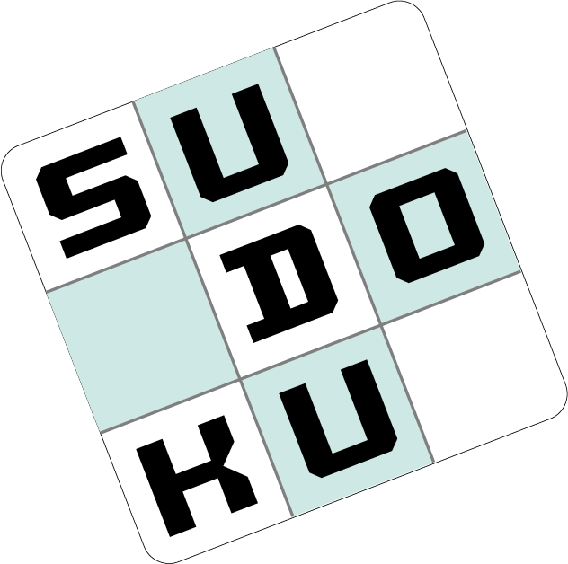

  

# sudoku
Sudoku game project in C++
It's popular form of number game. In its simplest and most common configuration, sudoku consists of a 9 × 9 grid with numbers appearing in some of the squares. The object of the puzzle is to fill the remaining squares.

# DESCRIPTION
Sudoku is based entirely on logic, without any arithmetic involved, and the level of difficulty is determined by the quantity and positions of the original numbers.

# Sudoku rules
While solving the puzzle, you need to follow one sudoku rule only. You have to fill in the blank cells with numbers from 1 to 9, so that:
- in any row, 
- in any column,
- in any 3x3 subgrid
numbers were used only once without any repetitions.

# INSTALLATION
Clone this repository: git clone https://github.com/oussema-fatnassi/sudoku.git 
Navigate to the game directory: cd sudoku

CREDITS
Developed by Baptiste APPRIOU, Oussema Fatnassi and Ali Abakar Issa